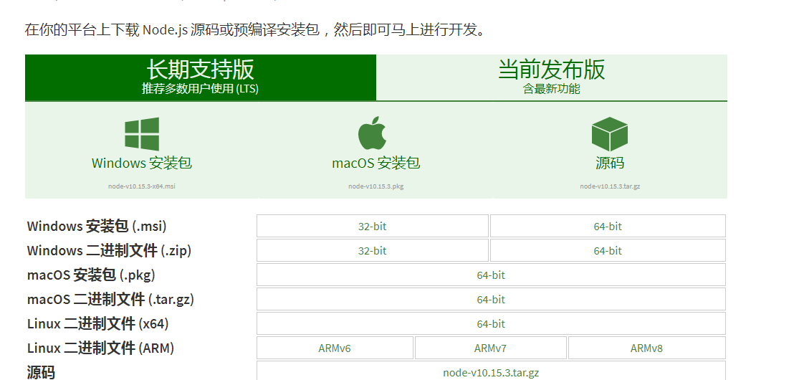

#【nodejs】nodejs生产环境部署初步 (CentOS环境)

    我有个项目是使用nodejs写的，需要部署到生产环境上，这种情况下需要装哪些东西呢？

### 一、 nodejs的安装


    
1. 通过 https://nodejs.org/zh-cn/download/ 找到上图页面，然后点击 linux 二进制文件64-bit，得到.tar.xz文件。
2. 将得到的.tar.xz文件上传到ssh服务器上，解压。
比如 将node-v10.15.3-linux-x64.tar.xz上传到/usr/local/后，则使用
```
    cd /usr/local
    tar -xvf node-v10.15.3-linux-x64.tar.xz
```
解压
3. 修改解压后文件夹为nodejs
```
    mv node-v10.15.3-linux-x64 nodejs
```
4. 将node加入软链接(让node命令可以直接执行)
```
    ln -s /usr/local/nodejs/bin/node /usr/local/bin/
```

### 二、pm2的安装
    nodejs项目一般就一个主线程，而且不够稳定，可能存在网络中某个地方异常没接住，然后直接挂掉的情况，虽然可以避免大部分的情况，但是生产环境咋可能完全避免啊。并且pm2也支持负载均衡等，是一个不错的进程管理工具，挺好的。

1. 全局安装pm2
```
    npm i pm2 -g
```
2. 建立软连接（如果node直接装在/usr/bin,/usr/local/bin这种跟环境变量相关文件夹里面则不需要）
```
    ln -s /usr/local/nodejs/bin/pm2 /usr/local/bin
```
然后就可以使用pm2了。

如果node项目的启动是
```
    node ./bin/www
```
则pm2的启动则是
```
    pm2 start ./bin/www
```
以此类推，由于本人是通过
```
    node build/index.js
```
来启动的，所以pm2的启动就是
```
    pm2 start build/index.js
```
如果需要热重载当前项目，可以
```
    pm2 reload <pmid|pid|'build/index.js'>
```
如果需要直接重启就
```
    pm2 restart <pmid|pid|'build/index.js'>
```
也可以
```
    pm2 list
```
查看所有由pm2管理的进程

### 三、nginx的安装

    首先，我并不建议直接利用root用户强行让nodejs项目监听80端口；而建议改用nginx的方式来反向代理到1024以上端口。其次，1024以下端口的监听需要项目以root权限方式启动才行，否则是没有权限来监听的。

    对于nginx的安装，需要下载一个未编译版的去编译，如果缺少gcc相关的也需要安装，具体请自行百度谷歌。由于本人所在的服务器已经拥有了gcc相关的东西，所以不需要安装

    但是本人也缺少pcre，所以需要安装这个。

    以下是安装nginx安装前需要安装的依赖命令
```
    yum update
    yum -y install gcc pcre pcre-devel zlib zlib-devel openssl openssl-devel
```

nginx的下载: 
https://nginx.org/en/download.html
选择nginx-1.15.12下载.tar.gz，上传到服务端，然后解压

```
    tar -zxvf nginx-1.15.12.tar.gz
    cd nginx-1.15.12
```

编译
```
    ./configure
    make
    make install

    whereis nginx
```
编译安装了之后通过whereis命令来确定nginx，然后可以通过建立软链接或者加入全局变量等方式来直接使用nginx命令（这是后话了）

一般来说，安装后都是在.../nginx-1.15.12下，
```
    cd ../nginx
```
确定了nginx的安装目录。
然后通过修改conf/nginx.conf文件配置来确定如何用nginx进行转发、负载均衡、静态文件部署等等

nginx.conf
```conf
    server {
        listen       80;
        server_name  localhost;

        #charset koi8-r;

        #access_log  logs/host.access.log  main;

        location / {
            proxy_pass http://xxx.com:6666;
            proxy_redirect off;
            
            add_header X-Frame-Options SAMEORIGIN;
            add_header X-Content-Type-Options nosniff;
            add_header X-XSS-Protection "1; mode=block";
            add_header Content-Security-Policy "default-src 'self'";
        }

        location /html {
            alias /usr/local/xxxx/;
            index index.html;
        }

        #其他配置
    }
```
在server模块中适当修改配置来满足反向代理条件(proxy_pass,proxy_redirect)、同域和XSS防护(add_header系列)、静态文件部署(location /html模块，可以让/html下的所有路径都指向对应的静态文件)；具体可以百度/谷歌搜nginx配置。

### 四、nodejs项目到服务端

1. 本地用
```
    git push
```
上传到git上

2. 服务端上

```
    mkdir xxx
    cd xxx
    git clone git@github.com:xxx.git .

    git reset --hard
    git pull
```
其中第一次用git clone，后面都用git pull。如果git pull出问题就用git reset --hard，因为服务端只负责更新代码。

然后
```
    npm i --production
```
安装依赖，有时候更新时如果还需要增加依赖就用上述方式更新。
然后再用pm2启动/重启，具体上面也有。

### 五、关于typescript的express项目
这类项目的git上最好还是把编译成js的文件夹也上传上去，这样到服务端上就不需要用类似于tsc或者gulp来编译了。

[返回主页](../readme.md)


